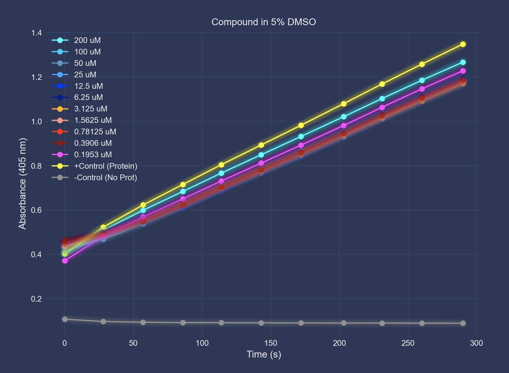

# pNPP Assay Plot

pNPP Assay Plot graphs data from the SpectraMax i3x plate reader for pNPP kinetic assays for Protein Tyrosine Phosphatases. The script can be further modified for any assays that use this plate reader.

## Plot Examples

## Built With

* [Python 3](https://www.python.org/) - Language